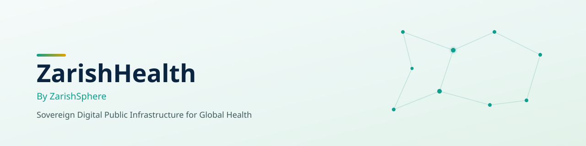

<picture>
  <source media="(prefers-color-scheme: dark)" srcset="./assets/zarishhealth-banner-dark.svg">
  <source media="(prefers-color-scheme: light)" srcset="./assets/zarishshealth-banner-light.svg">
  
</picture> 

   

