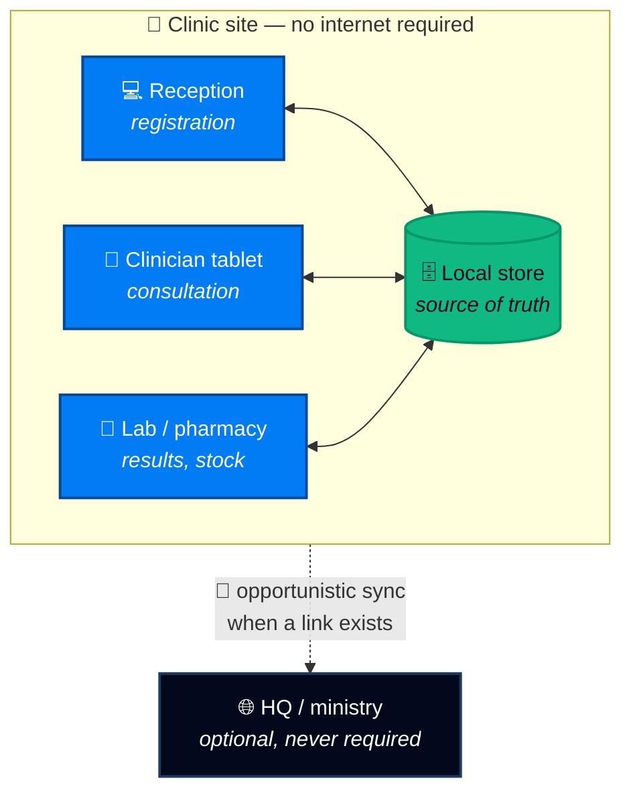

<!--
  ZarishHealth — GitHub organization profile
  Repo:  https://github.com/zarishhealth/.github   →   profile/README.md

  IMAGE PATHS: absolute raw.githubusercontent.com URLs are used deliberately.
  Relative paths (./assets/...) are unreliable on the rendered *organization
  profile page* — they resolve correctly inside the repo but not always on the
  org landing page. Absolute raw URLs work in both places.

  If you rename the default branch from `main`, find-and-replace `/main/` below.
  After replacing an image file, GitHub's Camo cache can serve the old one for a
  few minutes — append ?v=2 to bust it.

  Placeholders to fill in are marked  <!-- TODO -->
-->

<div align="center">

<picture>
  <source media="(prefers-color-scheme: dark)" srcset="https://raw.githubusercontent.com/zarishhealth/.github/main/profile/assets/banner/zarishhealth-banner-github-readme-wide-2560x640.png">
  <source media="(prefers-color-scheme: light)" srcset="https://raw.githubusercontent.com/zarishhealth/.github/main/profile/assets/banner/zarishhealth-banner-github-readme-light-1280x320.png">
  
</picture>

<br><br>

### Ultra-portable, self-hosted, offline-first Health Information System

**Complete clinical software that runs on a laptop in a tent, syncs over local Wi-Fi,<br>and never phones home to anyone's cloud.**

<br>

[](https://zarishhealth.github.io/)
[](#-why-zarishhealth)
[](#-why-zarishhealth)
[](#-licence)

<br>

<a href="https://zarishhealth.github.io/"><b>Website</b></a> &nbsp;·&nbsp;
<a href="#-what-it-does"><b>What it does</b></a> &nbsp;·&nbsp;
<a href="#-how-it-works"><b>How it works</b></a> &nbsp;·&nbsp;
<a href="#-repositories"><b>Repositories</b></a> &nbsp;·&nbsp;
<a href="#-get-started"><b>Get started</b></a> &nbsp;·&nbsp;
<a href="#-brand-kit"><b>Brand kit</b></a>

</div>

<br>

---

## 🩺 What it does

**ZarishHealth** is a complete, multi-platform, vendor-independent Health Information System built for low-resource environments, non-profit field operations, and clinical facilities.

It runs entirely offline on local devices and synchronises across a local Wi-Fi network — no external cloud, no proprietary vendor, no per-seat licence, no internet dependency. When connectivity exists, it uses it. When it doesn't, nothing stops.

<br>

<table>
<tr>
<td width="33%" valign="top">

### 📴 Offline-first
Not "offline-tolerant." The local device is the source of truth. Connectivity is an optimisation, never a requirement.

</td>
<td width="33%" valign="top">

### 🏠 Self-hosted
Runs on hardware you already own — a clinic laptop, a mini-PC, a field server. Your data never leaves the premises unless you send it.

</td>
<td width="33%" valign="top">

### 🔓 Vendor-independent
Open formats, open standards, open source. No lock-in, no licence renewal that can strand a clinic mid-season.

</td>
</tr>
<tr>
<td valign="top">

### 🔄 Peer sync over LAN
Devices discover each other on local Wi-Fi and reconcile automatically. No central server required for a site to function.

</td>
<td valign="top">

### 💻 Multi-platform
Desktop, mobile and browser from one codebase, so the same records follow the clinician between the ward and the field.

</td>
<td valign="top">

### 🪶 Ultra-portable
Designed for constrained hardware, intermittent power and low bandwidth — the actual conditions of the places that need it most.

</td>
</tr>
</table>

<br>

---

## 🔧 How it works



**The rule that drives every design decision:** a site must remain fully operational with its uplink cut. Sync is something that happens *to* a working system, never something it waits for.

<br>

<details>
<summary><b>🏕️ Who this is built for</b> — click to expand</summary>

<br>

| Setting | The problem ZarishHealth solves |
| --- | --- |
| **Humanitarian field operations** | Cloud EMRs are unusable where there is no reliable uplink. Paper doesn't aggregate. |
| **Rural & district clinics** | Commercial HIS licensing costs more than the clinic's annual equipment budget. |
| **Mobile & outreach teams** | Records collected in a village must merge cleanly with the base clinic on return. |
| **Refugee & displacement response** | Deployments must stand up in days on borrowed hardware, not months on procurement. |
| **Ministries & NGO networks** | Many autonomous sites, occasional aggregation, no dependence on a single vendor. |

</details>

<details>
<summary><b>⚙️ Engineering principles</b> — click to expand</summary>

<br>

- **Local-first data.** The device holds a complete, usable record. Sync reconciles; it does not gatekeep.
- **Deterministic merges.** Two sites editing the same record offline must converge without a human arbitrating every conflict.
- **Constrained-hardware budget.** Performance targets are set on modest field hardware, not developer laptops.
- **Open standards at the boundary.** Interoperable export so data outlives any one tool — including this one.
- **Boring, auditable dependencies.** Field software that cannot be patched for six months must be conservative by construction.
- **Privacy by architecture.** Data that never leaves the building cannot be breached from outside it.

</details>

<details>
<summary><b>🔐 A note on clinical & regulatory claims</b> — click to expand</summary>

<br>

ZarishHealth is health *infrastructure*. Regulatory posture — HIPAA, GDPR, national health-data law, medical-device classification — depends on how **you** deploy, configure and operate it, and on your jurisdiction.

The project provides the technical building blocks for a compliant deployment. It does not, and cannot, confer compliance by itself. Deployments handling real patient data should be reviewed by someone qualified in the relevant jurisdiction before going live.

</details>

<br>

---

## 📦 Repositories

<!-- TODO: replace the rows below with the real repositories as they land.
     Keep the badge style consistent so the table reads as one system. -->

| Repository | What it is | Status |
| --- | --- | --- |
| [`zarishhealth.github.io`](https://github.com/zarishhealth/zarishhealth.github.io) | Project website & documentation |  |
| [`.github`](https://github.com/zarishhealth/.github) | Org profile, brand kit, shared community health files |  |
| _core_ | Clinical data model & sync engine |  |
| _app_ | Desktop, mobile & web client |  |
| _deploy_ | Field deployment scripts & images |  |

<br>

---

## 🚀 Get started

<table>
<tr>
<td width="50%" valign="top">

#### 📖 Read
Start with the docs — architecture, deployment models and the offline-sync design.

**→ [zarishhealth.github.io](https://zarishhealth.github.io/)**

</td>
<td width="50%" valign="top">

#### 🛠️ Build
Browse the repositories, open an issue, or pick up something labelled `good first issue`.

**→ [Repositories](https://github.com/orgs/zarishhealth/repositories)**

</td>
</tr>
<tr>
<td valign="top">

#### 💬 Discuss
Deployment questions, field reports and design debate belong in Discussions.

**→ [Discussions](https://github.com/orgs/zarishhealth/discussions)**

</td>
<td valign="top">

#### 🏥 Deploy
Running ZarishHealth at a site? Tell us what broke. Field reports are the most valuable contribution there is.

**→ [Open an issue](https://github.com/zarishhealth/.github/issues)**

</td>
</tr>
</table>

<br>

---

## 🤝 Contributing

Contributions are welcome from clinicians, field logisticians, translators, designers and engineers alike — this project needs all five.

Especially valuable:

- **Field reports.** What failed at 2am in a clinic with 6% battery? That's the bug report nobody else can write.
- **Localisation.** Health software in the wrong language is health software nobody uses.
- **Low-resource testing.** Old hardware, flaky power, hostile networks — if you have them, you have a test lab.
- **Clinical review.** Workflows that are technically elegant and clinically wrong are worse than useless.

<br>

---

## 🎨 Brand kit

<div align="center">


</div>

<br>

The complete identity system lives in [`profile/assets/`](https://github.com/zarishhealth/.github/tree/main/profile/assets) — logos, icons, favicons, app icons, avatars, social cards, banners, badges, design tokens and backgrounds, all generated from one vector master.

| Document | Purpose |
| --- | --- |
| [**BRANDING.md**](https://github.com/zarishhealth/.github/blob/main/profile/assets/BRANDING.md) | Full guidelines — clear space, colour, typography, per-platform sizes, accessibility |
| [**SKILL.md**](https://github.com/zarishhealth/.github/blob/main/profile/assets/SKILL.md) | Machine-readable brand spec, so an AI assistant applies the identity correctly |
| [**ASSETS-INDEX.md**](https://github.com/zarishhealth/.github/blob/main/profile/assets/ASSETS-INDEX.md) | Every file, with sizes |
| [**brand-tokens.json**](https://github.com/zarishhealth/.github/blob/main/profile/assets/brand-tokens.json) · [**brand.css**](https://github.com/zarishhealth/.github/blob/main/profile/assets/brand.css) | Design tokens for code |

<br>

<div align="center">


&nbsp;

&nbsp;


</div>

<details>
<summary><b>Use these badges in your own README</b></summary>

<br>

```markdown

```

```html

```

Colours: Zarish Blue `#017CF5` · Vital Green `#10B981` · Deep Navy `#02091C`

</details>

<br>

---

## 📜 Licence

Source code and brand assets are released under the **MIT Licence**.

The ZarishHealth name and mark identify the project. Use them to *refer* to ZarishHealth — "built with ZarishHealth", "a ZarishHealth deployment". Please don't use them to brand a fork or imply an endorsement that doesn't exist.

<br>

---

<div align="center">


<br><br>

**Health software shouldn't require the internet to save a life.**

<sub>Built for the places the cloud forgot.</sub>

<br>

<a href="https://zarishhealth.github.io/">zarishhealth.github.io</a>

</div>
