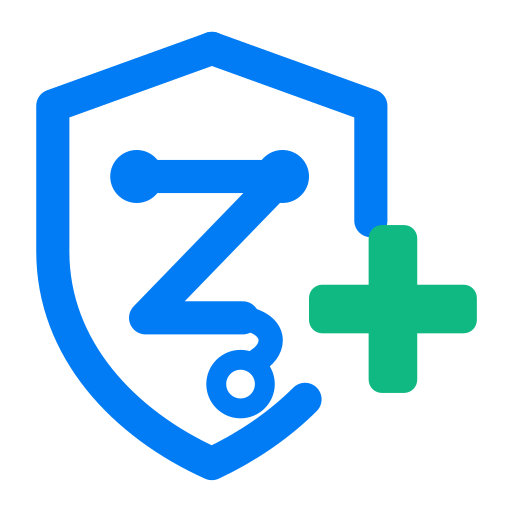

<div align="center">


# ZarishHealth — Brand Guidelines

**Version 1.0.0** · 234 files · SVG + PNG + ICO · MIT-licensed assets

</div>

---

## Table of contents

1. [What this kit is](#1-what-this-kit-is)
2. [Quick start](#2-quick-start)
3. [File naming convention](#3-file-naming-convention)
4. [Directory map](#4-directory-map)
5. [The logo](#5-the-logo)
6. [Clear space, minimum sizes & misuse](#6-clear-space-minimum-sizes--misuse)
7. [Colour system](#7-colour-system)
8. [Typography](#8-typography)
9. [Format reference — what to use where](#9-format-reference--what-to-use-where)
10. [Favicons & web app icons](#10-favicons--web-app-icons)
11. [Native app icons](#11-native-app-icons)
12. [Social & Open Graph cards](#12-social--open-graph-cards)
13. [Banners & covers](#13-banners--covers)
14. [Avatars](#14-avatars)
15. [README badges](#15-readme-badges)
16. [Hot-linking from GitHub (real-time URLs)](#16-hot-linking-from-github-real-time-urls)
17. [Accessibility](#17-accessibility)
18. [Voice & naming](#18-voice--naming)
19. [Regenerating / extending the kit](#19-regenerating--extending-the-kit)
20. [Licence & contact](#20-licence--contact)

---

## 1. What this kit is

A complete, production-ready identity system for **ZarishHealth** — every logo lockup, icon, favicon, app icon, avatar, social card, banner, badge, background and design token needed to ship a modern product across web, mobile, desktop, GitHub, social media, print and email.

Everything is generated from **one vector master**, so every file is pixel-consistent with every other file. Nothing here is a raster upscale.

**Design tokens** (`brand-tokens.json`, `brand.css`) ship alongside the artwork so engineering and design use the same numbers.

> **One placeholder to edit:** the tagline **"Open health infrastructure"** appears on the social cards. It is a stand-in. Replace it with your real tagline and regenerate (see §19), or use the tagline-free `banner/` files instead.

---

## 2. Quick start

**Drop the folder into your repo:**

```
.github/profile/assets/
```

**Use it in your README:**

```markdown
<p align="center">
  
  
</p>
```

**Use it on the web:** copy `head-snippet.html` into your `<head>`, ship `brand.css`, and serve `favicon/`, `app-icon/`, `social/`, `site.webmanifest` and `browserconfig.xml` from your web root.

**The three files that matter most**, if you only ship three:

| File | Why |
| --- | --- |
| `favicon/zarishhealth-favicon-web.ico` | Every browser requests it, including ones that ignore `<link>` |
| `favicon/zarishhealth-favicon-web.svg` | Crisp at any size, adapts to dark mode |
| `app-icon/zarishhealth-appicon-ios-180x180.png` | iOS "Add to Home Screen" — otherwise iOS uses a screenshot |

---

## 3. File naming convention

Every file follows one predictable pattern:

```
zarishhealth-<type>-<target>[-<variant>][-<WxH>].<ext>
```

| Segment | Meaning | Examples |
| --- | --- | --- |
| `zarishhealth` | Constant prefix — always first, always lowercase | — |
| `<type>` | What the asset *is* | `logo`, `wordmark`, `icon`, `favicon`, `appicon`, `avatar`, `social`, `banner`, `badge`, `pattern`, `reference` |
| `<target>` | Where it is *used* — a platform, surface or background context | `ios`, `android`, `pwa`, `web`, `windows`, `macos`, `github`, `linkedin`, `x`, `slack`, `npm`, `opengraph`, `print`, `email`, `light`, `dark` |
| `<variant>` | Colour treatment or shape, when several exist | `color`, `mono-black`, `mono-white`, `duotone`, `transparent`, `solid-blue`, `circle-navy`, `maskable`, `simple` |
| `<WxH>` | Exact pixel dimensions, when the size is the point | `180x180`, `1200x630`, `1128x191` |
| `<ext>` | `svg`, `png`, `ico` | — |

**Worked examples**

```
zarishhealth-logo-horizontal-dark.svg         logo, for dark backgrounds, vector
zarishhealth-icon-circle-navy-256x256.png     symbol, navy circle plate, 256px
zarishhealth-favicon-web-32x32.png            favicon, web target, 32px
zarishhealth-appicon-maskable-android-512x512.png   Android adaptive icon
zarishhealth-social-opengraph-1200x630.png    link-preview card, OG spec
zarishhealth-banner-linkedin-company-1128x191.png   LinkedIn page cover
zarishhealth-badge-readme-powered-by.svg      README shield
```

Lowercase, hyphen-separated, no spaces, no underscores, no version numbers in filenames — so URLs stay stable forever and hot-links never break.

---

## 4. Directory map

*Repository URL:* (https:github.com/zarishhealth/.github)

```
.github/profile/assets/
├── BRANDING.md               ← you are here
├── SKILL.md                  ← machine-readable brand skill for AI agents
├── ASSETS-INDEX.md           ← every file, with byte sizes
├── LICENSE.md
├── brand-tokens.json         ← W3C-style design tokens
├── brand.css                 ← CSS custom properties, light + dark
├── head-snippet.html         ← paste-ready <head> block
├── site.webmanifest          ← PWA manifest
├── browserconfig.xml         ← Windows tiles
├── logo/         42 files    horizontal · stacked · wordmark · plates
├── icon/         66 files    symbol only, transparent + plated
├── favicon/      13 files    ico · svg (adaptive) · png 16→512 · pinned tab
├── app-icon/     18 files    iOS · iPadOS · Android · PWA · maskable · Windows · macOS · watchOS · tvOS
├── avatar/       11 files    GitHub · social · Slack · Discord · npm · Docker · Gravatar
├── social/       16 files    Open Graph · X · GitHub · LinkedIn · WhatsApp
├── banner/       26 files    README · docs · X · LinkedIn · Facebook · YouTube · email · slides · splash
├── badge/        22 files    README shields, SVG + PNG
├── pattern/       8 files    network backgrounds · print watermark
└── reference/     7 files    palette · typography · clear-space sheets
```

---

## 5. The logo

### 5.1 Anatomy

The mark is three symbols fused into one:

| Element | Meaning |
| --- | --- |
| **Shield** | Protection, privacy, trust — patient data safety |
| **Stethoscope forming a "Z"** | Clinical care, and the Zarish initial. Earpieces cap the top bar; the tubing runs the diagonal and ends in a chestpiece |
| **Cross (+)** | Health and care. It deliberately **breaks the shield outline** on the right — the gap is intentional geometry, not a rendering bug |

The gap is drawn as a split path, not a mask, so the mark renders identically in every SVG engine — browsers, Figma, Inkscape, iOS, Android, PDF printers and image CDNs alike.

### 5.2 Three forms

| Form | File stem | Use when |
| --- | --- | --- |
| **Horizontal lockup** | `logo/zarishhealth-logo-horizontal-*` | Default. Headers, navbars, email, docs, banners, slide footers |
| **Stacked lockup** | `logo/zarishhealth-logo-stacked-*` | Square or narrow space — splash screens, posters, merchandise, centred hero |
| **Symbol only** | `icon/zarishhealth-icon-*` | Favicons, app icons, avatars, badges — anywhere the name already appears nearby |
| **Wordmark only** | `logo/zarishhealth-wordmark-*` | When the symbol appears separately on the same surface |

### 5.3 Colour variants

| Variant | Mark | Cross | Wordmark | Use on |
| --- | --- | --- | --- | --- |
| `light` | Zarish Blue | Vital Green | Deep Navy | White / light backgrounds |
| `dark` | White | Vital Green | White | Navy / photo / dark UI |
| `duotone` | Zarish Blue | Vital Green | "Zarish" navy + "Health" blue | Marketing, decks, hero moments |
| `mono-black` | Black | Black | Black | Fax, engraving, single-colour print, stamps |
| `mono-white` | White | White | White | Dark photography, embroidery, etched glass |
| `mono-blue` | Blue | Blue | Blue | Single-colour brand applications |

`logo/zarishhealth-logo-plate-*` are pre-baked onto a solid background with correct padding — handy when a platform strips transparency.

### 5.4 The simplified mark

Below ~32 px the stethoscope tubing and chestpiece turn to mush. Files named `…-simple-…` drop those details and thicken the strokes. **The favicon set already uses the simplified mark at 16–64 px automatically.** Use `icon/zarishhealth-icon-simple-*` for any custom small rendering.

---

## 6. Clear space, minimum sizes & misuse

> See `reference/zarishhealth-reference-brand-clearspace.png`

**Clear space:** keep a margin of **x = 25% of the mark's height** on all four sides. No type, rules, image edges or other logos inside it.

**Minimum sizes**

| Asset | Digital minimum | Print minimum |
| --- | --- | --- |
| Full mark | 32 px | 10 mm |
| Simplified mark | 16 px | 5 mm |
| Horizontal lockup | 120 px wide | 30 mm |
| Stacked lockup | 96 px wide | 25 mm |

**Never**

- Recolour the mark outside the approved variants
- Add shadows, bevels, glows, outlines or gradients to the mark
- Stretch, squash, skew or rotate it
- Rebuild the wordmark in a different typeface, or re-space the letters
- Place the colour variant on a busy photo — use `mono-white` or a plate
- Put the mark inside a second shape (a circle inside a circle)
- Use the symbol as a favicon *without* the simplified variant below 32 px

---

## 7. Colour system

> See `reference/zarishhealth-reference-brand-palette.png` · machine-readable in `brand-tokens.json`

### Core

| Token | Hex | RGB | Role |
| --- | --- | --- | --- |
| **Zarish Blue** | `#017CF5` | 1, 124, 245 | Primary. Mark, links, primary buttons, focus rings |
| Zarish Blue Hover | `#0163C4` | 1, 99, 196 | Hover |
| Zarish Blue Active | `#014A93` | 1, 74, 147 | Pressed |
| **Vital Green** | `#10B981` | 16, 185, 129 | The cross. Success, "healthy", positive vitals |
| **Care Teal** | `#06B6D4` | 6, 182, 212 | Data, connectivity, charts, secondary accents |
| **Deep Navy** | `#02091C` | 2, 9, 28 | Dark surfaces, headings, banner backgrounds |
| Cloud | `#F5F7FA` | 245, 247, 250 | App background, subtle surfaces |
| White | `#FFFFFF` | — | On-brand text and marks |

### Ramps

| Scale | Shades |
| --- | --- |
| `blue` | 50 `#E8F2FE` · 100 `#CFE5FD` · 200 `#9ECBFB` · 300 `#6EB1F9` · 400 `#3D97F7` · **500 `#017CF5`** · 600 `#0163C4` · 700 `#014A93` · 800 `#003162` · 900 `#001931` |
| `navy` | 600 `#1E3A63` · 700 `#123055` · 800 `#0A1A34` · **900 `#02091C`** |
| `green` | 400 `#34D399` · **500 `#10B981`** · 600 `#059669` |
| `teal` | 400 `#22D3EE` · **500 `#06B6D4`** · 600 `#0891B2` |
| `slate` | 50 `#F8FAFC` → 900 `#0F172A` (10 steps, neutral UI) |

### Semantic states

| State | Hex |
| --- | --- |
| Success | `#10B981` |
| Warning | `#F59E0B` |
| Danger | `#EF4444` |
| Info | `#017CF5` |
| Critical | `#BE123C` |

### Gradients

```css
--zh-gradient-brand:   linear-gradient(135deg,#017CF5 0%,#0148A8 100%);
--zh-gradient-network: linear-gradient(135deg,#02091C 0%,#061532 55%,#0A2247 100%);
```

### Colour rules

- **Blue carries the brand; green is a highlight.** Green never exceeds ~10% of a composition.
- On navy, switch the primary to `blue-400 #3D97F7` for readable contrast — `brand.css` already does this in dark mode.
- Clinical UI: reserve red and amber strictly for genuine alerts. A brand that cries wolf gets ignored where it matters most.

---

## 8. Typography

> See `reference/zarishhealth-reference-brand-typography.png`

| Role | Typeface | Weights | Licence |
| --- | --- | --- | --- |
| **Primary** | **Inter** | 400 / 500 / 600 / 700 / 800 | SIL OFL 1.1 — free for commercial use, embeddable |
| **Code & data** | **JetBrains Mono** | 400 / 600 | SIL OFL 1.1 |
| **Fallback stack** | `ui-sans-serif, system-ui, -apple-system, 'Segoe UI', Roboto, sans-serif` | — | — |

```html
<link rel="preconnect" href="https://fonts.gstatic.com" crossorigin>
<link href="https://fonts.googleapis.com/css2?family=Inter:wght@400;500;600;700;800&family=JetBrains+Mono:wght@400;600&display=swap" rel="stylesheet">
```

| Style | Size | Weight | Tracking |
| --- | --- | --- | --- |
| Display / H1 | 56–72 px | 800 | −0.015em |
| H2 | 40–48 px | 700 | −0.015em |
| H3 | 28–32 px | 700 | −0.01em |
| Body large | 20–22 px | 400 | 0 |
| Body | 16–18 px | 400 | 0 |
| UI label | 14–15 px | 600 | 0 |
| Caps label | 12–14 px | 700 | +0.08em |
| Code | 14–16 px | 400 | 0 |

**Wordmark note:** the shipped wordmark is Inter 800 at −0.015em tracking, **converted to outlines**. No font file is needed to render any SVG in this kit. Never re-typeset the wordmark — use the supplied files.

---

## 9. Format reference — what to use where

| Format | Use it for | Avoid it for |
| --- | --- | --- |
| **SVG** | Web, README, docs, app UI, print, anything that scales | Email clients, OG/social cards (most strip or ignore SVG) |
| **PNG** | Social cards, app icons, email, raster fallback, transparency | Large flat artwork where SVG is available (10–50× bigger) |
| **ICO** | `favicon.ico` only — legacy browsers, RSS readers, crawlers | Anything else |
| **WebP / AVIF** | Optional modern web compression for photography | Logos (SVG is smaller and sharper) |
| **PDF / EPS** | Commercial print, signage, vendor handoff | Screen |

**Rules of thumb**

- Vector first. Reach for PNG only where a platform demands raster.
- Social platforms and email **do not render SVG** — always ship PNG there.
- iOS touch icons **must be opaque**; transparency turns black. The shipped iOS PNGs are already flattened onto Zarish Blue.
- Android adaptive icons **must be full-bleed** with content inside the central 80% safe circle — that is what `-maskable-` means.
- Keep OG images under 1 MB (hard ceiling 8 MB) or some scrapers skip them.

---

## 10. Favicons & web app icons

The modern minimum is three files plus a manifest — the rest is progressive enhancement. All of it is in `favicon/`.

| File | Size | Consumed by |
| --- | --- | --- |
| `zarishhealth-favicon-web.ico` | 16 + 32 + 48 bundled | Every browser's default `/favicon.ico` request; RSS readers, crawlers, legacy embeds |
| `zarishhealth-favicon-web.svg` | vector | Chrome, Firefox, Edge, Safari 17+. **Adapts to dark mode** via an embedded `prefers-color-scheme` rule |
| `zarishhealth-favicon-web-static.svg` | vector | Same, without dark-mode switching |
| `zarishhealth-favicon-web-16x16.png` | 16 | Browser tab, classic |
| `zarishhealth-favicon-web-32x32.png` | 32 | Retina tab, bookmarks, taskbar |
| `zarishhealth-favicon-web-48x48.png` | 48 | Windows site shortcuts |
| `…-64/96/128/192/256/512x…png` | — | High-DPI, PWA, app listings, store fallbacks |
| `zarishhealth-favicon-safari-pinned-tab.svg` | vector, single-colour | Safari pinned tabs (must be flat black artwork — it is) |

Paste `head-snippet.html` into `<head>`. It already includes:

```html
<link rel="icon" href="/favicon/zarishhealth-favicon-web.ico" sizes="32x32">
<link rel="icon" href="/favicon/zarishhealth-favicon-web.svg" type="image/svg+xml">
<link rel="apple-touch-icon" href="/app-icon/zarishhealth-appicon-ios-180x180.png">
<link rel="manifest" href="/site.webmanifest">
```

`sizes="32x32"` on the `.ico` is deliberate — it stops Chrome preferring the ICO over the sharper SVG.

---

## 11. Native app icons

| Platform | File | Notes |
| --- | --- | --- |
| iOS home screen | `zarishhealth-appicon-ios-180x180.png` | Opaque, square, full-bleed. iOS applies its own corner radius — never pre-round it |
| iOS (legacy/small) | `…-ios-120x120.png` | iPhone @2x |
| iPadOS | `…-ipados-167x167.png` | iPad Pro |
| App Store | `…-ios-1024x1024.png` | No transparency, no rounded corners, no alpha channel |
| Android launcher | `…-android-192x192.png`, `…-android-512x512.png` | Standard |
| **Android adaptive** | `…-maskable-android-192x192.png`, `…-maskable-android-512x512.png` | Full-bleed; content sits inside the central 80% safe circle so OEM circle/squircle/teardrop masks never clip it. Declare `"purpose": "maskable"` |
| PWA | `…-pwa-192x192.png`, `…-pwa-512x512.png` | Referenced from `site.webmanifest` |
| macOS | `…-macos-1024x1024.png` | Squircle with Apple's standard margin baked in |
| Windows tiles | `…-windows-150x150.png`, `…-270x270.png`, `…-310x310.png` | Wired up in `browserconfig.xml` |
| watchOS | `…-watchos-1024x1024.png` | Circular |
| tvOS | `…-tvos-400x400.png` | Flat, opaque |
| **Master** | `zarishhealth-appicon-source-master.svg` | 1024 vector source — regenerate any size from this |

Both `any` and `maskable` icons belong in the manifest. Do **not** mark a single icon `"any maskable"` — the padding requirements conflict and you get a shrunken icon on desktop.

---

## 12. Social & Open Graph cards

`1200×630` is the one size that renders correctly on Facebook, LinkedIn, Slack, Discord, WhatsApp, iMessage and X. Everything else in `social/` is a fine-tuned variant.

| File | Platform |
| --- | --- |
| `zarishhealth-social-opengraph-1200x630.png` | Universal default — set this as `og:image` |
| `zarishhealth-social-opengraph-light-1200x630.png` | Light-background alternative |
| `zarishhealth-social-x-1200x675.png` | X `summary_large_image` (16:9) |
| `zarishhealth-social-github-1280x640.png` | GitHub repo **Settings → Social preview** |
| `zarishhealth-social-linkedin-1200x627.png` | LinkedIn posts & link cards |
| `zarishhealth-social-facebook-1200x630.png` | Facebook |
| `zarishhealth-social-slack-unfurl-1200x630.png` | Slack unfurls |
| `zarishhealth-social-whatsapp-800x800.png` | Square preview |

Keep critical content inside the centre **1080×600** safe zone — these cards already do. Always ship PNG, always set `og:image:width` / `og:image:height`, and always add `og:image:alt`. LinkedIn caches aggressively; use Post Inspector to bust it after a change.

---

## 13. Banners & covers

| File | Size | Surface |
| --- | --- | --- |
| `…-banner-github-readme-1280x320` | 1280×320 | README hero (`-wide` = 2560×640 retina, `-light` = light theme) |
| `…-banner-docs-header-2400x480` | 2400×480 | Docs site header |
| `…-banner-x-header-1500x500` | 1500×500 | X profile header |
| `…-banner-linkedin-company-1128x191` | 1128×191 | LinkedIn **company page** cover |
| `…-banner-linkedin-personal-1584x396` | 1584×396 | LinkedIn **personal** background |
| `…-banner-facebook-cover-851x315` | 851×315 | Facebook page cover |
| `…-banner-youtube-channel-2560x1440` | 2560×1440 | YouTube channel art — the safe area is the central **1546×423** |
| `…-banner-email-header-600x200` | 600×200 | Email header (`-light` variant for light templates) |
| `…-banner-slide-title-1920x1080` | 1920×1080 | Deck title slide |
| `…-banner-app-splash-1242x2688` | 1242×2688 | Mobile splash |

LinkedIn overlaps the lower-left of a company banner with the page logo, and crops harder on mobile — the shipped file keeps the lockup clear of that zone.

---

## 14. Avatars

Square source, centred symbol, safe under a circular crop.

| File | Where |
| --- | --- |
| `…-avatar-github-460x460` / `-1024x1024` | GitHub org & user |
| `…-avatar-social-400x400` / `-800x800` | X, Instagram, Mastodon, Threads |
| `…-avatar-slack-512x512` | Slack (squircle) |
| `…-avatar-discord-512x512` | Discord (navy) |
| `…-avatar-npm-256x256` | npm org |
| `…-avatar-docker-512x512` | Docker Hub |
| `…-avatar-gravatar-512x512` | Gravatar |
| `…-avatar-email-256x256` | Email client / BIMI-style |

Upload the **largest** available size — every platform downsamples better than it upsamples.

---

## 15. README badges

Eleven drop-in shields in `badge/` (SVG and 3× PNG), sized and styled to sit next to shields.io badges without looking foreign.

```markdown


```

Available: `powered-by`, `built-with`, `part-of`, `certified`, `status-live`, `license-mit`, `docs`, `version`, `fhir-r4`, `hipaa-ready`, `open-source`.

> `hipaa-ready`, `fhir-r4` and `certified` are **visual badges, not attestations.** Only display them where the underlying claim is actually true for your deployment.

You can also drive shields.io with brand colours:

```markdown

```

---

## 16. Hot-linking from GitHub (real-time URLs)

Once the folder is committed to `.github/profile/assets/`, every file is live and always current.

**Pattern**

```
https://raw.githubusercontent.com/<OWNER>/<REPO>/main/.github/profile/assets/<path>
```

**Example**

```markdown

```

**Notes that will save you an hour**

- `raw.githubusercontent.com` serves SVG as `text/plain`, so it renders in `` tags in Markdown but **not** as a live stylesheet. For SVG embedded in HTML pages, serve it from your own domain or GitHub Pages.
- GitHub proxies README images through Camo and caches them. After replacing a file, the old version can persist for minutes — append `?v=2` to bust it.
- **Use a branch name (`main`), never a commit SHA**, if you want the URL to stay current automatically. Use a tag (`v1.0.0`) if you want it frozen.
- GitHub Pages (`https://<owner>.github.io/<repo>/…`) serves correct MIME types and is the better host for favicons and manifests.
- Theme-aware README images:

```markdown


```

---

## 17. Accessibility

Health software gets used by tired people on bad screens in bright rooms. Contrast is a clinical safety feature.

| Pair | Ratio | Verdict |
| --- | --- | --- |
| `#02091C` navy on white | 18.9:1 | AAA — body text |
| White on `#017CF5` blue | 3.6:1 | **AA for large text & UI components only.** For body text on blue use `#014A93` |
| White on `#014A93` blue-700 | 9.1:1 | AAA |
| `#017CF5` blue on white | 3.6:1 | Large text, icons, borders — **not** body copy |
| `#0163C4` blue-600 on white | 5.6:1 | AA body text |
| White on `#10B981` green | 2.2:1 | **Fails.** Use navy text on green, or green on navy |
| `#3D97F7` blue-400 on `#02091C` navy | 7.4:1 | AAA — the dark-mode primary |

**Also**

- Never encode meaning in colour alone — pair every status colour with an icon or label.
- Alt text: `alt="ZarishHealth"` for the logo; `alt=""` when the mark is decorative beside the name.
- Focus rings: 2 px `#017CF5` with a 2 px offset, on both themes.
- Touch targets: 44×44 px minimum.
- Respect `prefers-reduced-motion` — the network pattern is static artwork for exactly this reason.

---

## 18. Voice & naming

- **ZarishHealth** — one word, capital Z, capital H. Never "Zarish Health", "ZARISHHEALTH", "zarishHealth" or "Zarish-Health".
- Lowercase `zarishhealth` is correct in filenames, package names, handles and URLs.
- First mention in a document uses the full name; later mentions may use "Zarish" only if unambiguous.
- Tone: clear, calm, precise. Health software should sound like a good clinician — confident, plain-spoken, never breathless. Avoid hype adjectives ("revolutionary", "cutting-edge") and avoid implying clinical or regulatory claims the product has not earned.

---

## 19. Regenerating / extending the kit

Every asset descends from one vector master. To change the brand colour, the tagline or any dimension, edit the source and regenerate — do not hand-patch individual PNGs, or they drift out of sync.

**Vector masters**

| Source of truth | File |
| --- | --- |
| Symbol | `icon/zarishhealth-icon-transparent-color.svg` |
| App icon | `app-icon/zarishhealth-appicon-source-master.svg` |
| Horizontal lockup | `logo/zarishhealth-logo-horizontal-light.svg` |
| Stacked lockup | `logo/zarishhealth-logo-stacked-light.svg` |
| Colour & type values | `brand-tokens.json` |

**Re-deriving rasters from a vector**

```bash
# PNG at any size
rsvg-convert -w 512 -h 512 icon/zarishhealth-icon-solid-blue.svg -o out-512.png
#   or: inkscape --export-type=png --export-width=512 <file>.svg
#   or: npx sharp-cli -i <file>.svg -o out.png resize 512 512

# multi-size .ico
magick out-16.png out-32.png out-48.png zarishhealth-favicon-web.ico

# PDF / EPS for print vendors
rsvg-convert -f pdf logo/zarishhealth-logo-horizontal-mono-black.svg -o logo-print.pdf
```

**Adding a new size:** keep the naming convention, add the file to `ASSETS-INDEX.md`, and note the platform in the matching section above.

---

## 20. Licence & contact

Artwork, tokens and documentation in this kit are released under the **MIT Licence** (see `LICENSE.md`) — free to use, modify and redistribute.

**Trademark is separate from copyright.** The ZarishHealth name and mark identify the project. You may use them to *refer* to ZarishHealth — "built with ZarishHealth", "compatible with ZarishHealth". You may not use them to imply endorsement, to brand a fork, or in a way that suggests your product *is* ZarishHealth.

Bundled typefaces are third-party: **Inter** and **JetBrains Mono**, both SIL Open Font License 1.1. No font binaries ship in this kit — all wordmarks are outlined vectors, so nothing here depends on a font being installed.

| | |
| --- | --- |
| **Version** | 1.0.0 |
| **Asset count** | 234 |
| **Formats** | SVG · PNG · ICO · JSON · CSS · XML · HTML |
| **Machine-readable brand spec** | `SKILL.md` + `brand-tokens.json` |

<div align="center">



</div>
